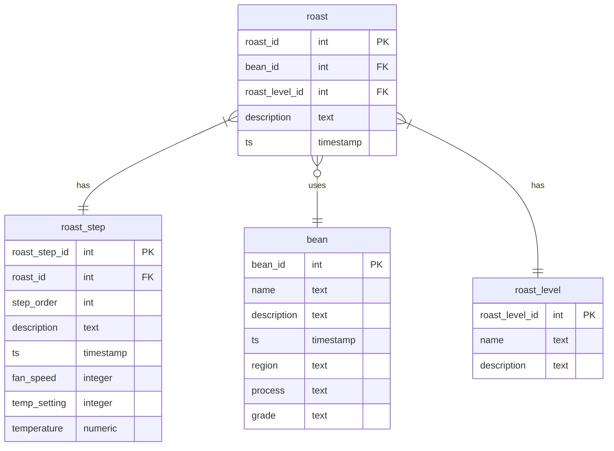

```mermaid
erDiagram
    bean {
        bean_id int PK
        name text
        description text
        ts timestamp
        region text
        process text
        grade text
    }

    roast {
        roast_id int PK
        bean_id int FK
        roast_level_id int FK
        description text
        ts timestamp
    }

    roast_step {
        roast_step_id int PK
        roast_id int FK
        step_order int
        description text
        
        ts timestamp
        fan_speed integer
        temp_setting integer
        temperature numeric
    }

    roast_level {
        roast_level_id int PK
        name text
        description text
    }

    roast }|--|| roast_step: has
    roast }o--|| bean: uses
    roast }|--|| roast_level: has
```